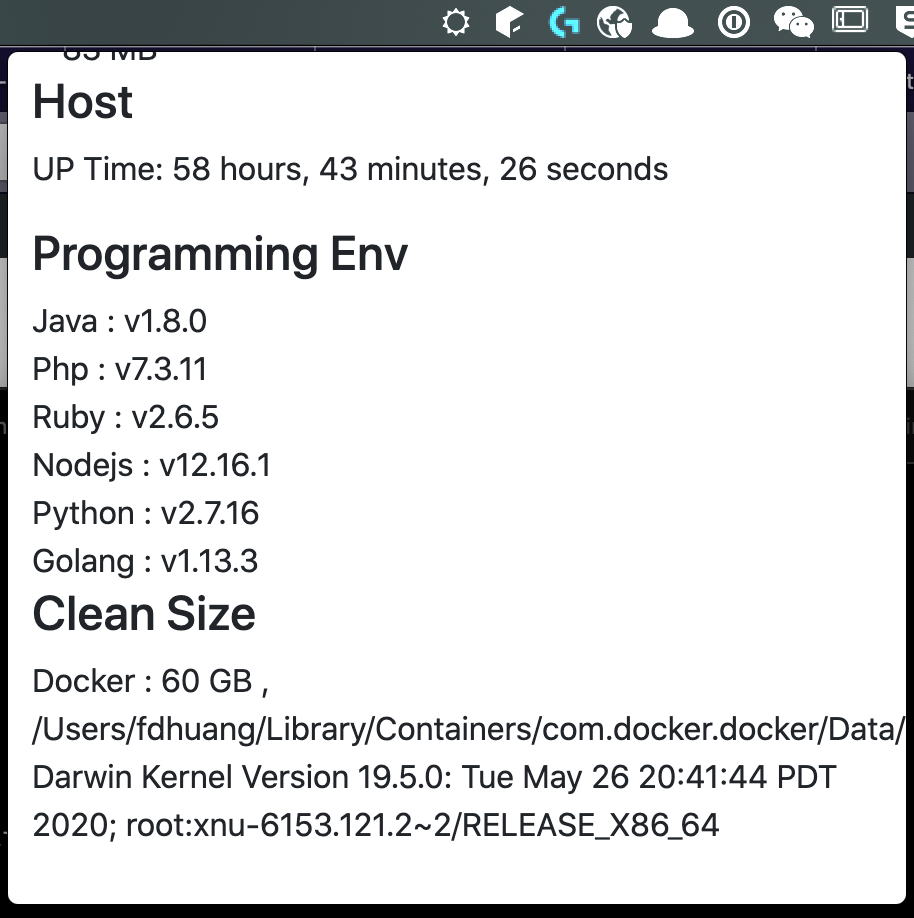

# Stadal

> A RPC-based client-server system status tools, with Rust + Electron architecture.



## Architecture (design)

 - RPC Server, (Using Rust) for read system status.
 - ~~RPC Client, (Using Rust to Node.js) for communication~~.
 - UI Client, (Using Electron) for cross platform UI support.

Node.js

 - [neon](https://github.com/neon-bindings/neon) Rust bindings for writing safe and fast native Node.js modules.

RPC

 - [tarpc](https://github.com/google/tarpc) is an RPC framework for rust with a focus on ease of use. Defining a service can be done in just a few lines of code, and most of the boilerplate of writing a server is taken care of for you.
 - [gRPC-rs](https://github.com/tikv/grpc-rs) is a Rust wrapper of gRPC Core. gRPC is a high performance, open source universal RPC framework that puts mobile and HTTP/2 first.

Refs:

 - [Xi Editor](https://github.com/xi-editor/xi-editor) project is an attempt to build a high quality text editor, using modern software engineering techniques. 
 - [Tray Electrorn](https://github.com/kevinsawicki/tray-example)  An example app for building a native-looking Mac OS X tray app with a popover using Electron.

Stats Demo App:

 - [bottom](https://github.com/ClementTsang/bottom) A cross-platform graphical process/system monitor with a customizable interface and a multitude of features. Supports Linux, macOS, and Windows. Inspired by both gtop and gotop.
 - [Zenith](https://github.com/bvaisvil/zenith) In terminal graphical metrics for your *nix system written in Rust.

Dev Setup:

 - Languages: [https://github.com/starship/starship](https://github.com/starship/starship)

System

 - [bandwhich](https://github.com/imsnif/bandwhich) is a CLI utility for displaying current network utilization by process, connection and remote IP/hostname.
 - [https://github.com/tbillington/kondo](https://github.com/tbillington/kondo) -  Save disk space by cleaning non-essential files from software projects. 

## Documents

Library:

 - [heim](https://github.com/heim-rs/heim) is an ongoing attempt to create the best tool for system information fetching (ex., CPU, memory, disks or processes stats) in the Rust crates ecosystem.

[Status library comparison](https://github.com/heim-rs/heim/blob/master/COMPARISON.md)

## Notes

requests

```
{"method":"client_started","params":{}}
```

```
{"method":"client_started","params":{}}
{"method":"send_memory","params":{}}
```

```
{"method":"client_started","params":{}}
{"method":"send_host","params":{}}
{"method":"send_memory","params":{}}
{"method":"send_languages","params":{}}
{"method":"send_sizes","params":{}}
```

## Development

 - core-lib, Stadal Core
 - gui, Electron UI
 - rpc, Stadal Core RPC
 - src, Stadal App
 - client, **deprecated**  for Rust RPC Client
 - stadaljs, **deprecated** for Rust PRC Client Node.js Binding
 - xrl, **deprecated** for Rust RPC Client
 - trace, for Rust RPC Server

LICENSE
===

RPC based on [xi-editor](https://github.com/xi-editor/xi-editor) with Apache 2.0 & Inspired by [xi-term](https://github.com/xi-frontend/xi-term)
